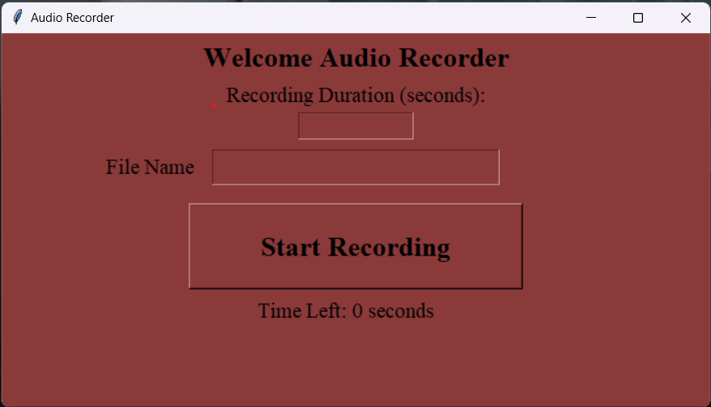

# Voice Recorder



A simple Python application for recording audio using a microphone. This application provides an intuitive graphical user interface (GUI) to start and stop audio recording and save the recorded audio as a WAV file.

## Table of Contents

- [Demo](#demo)
- [Features](#features)
- [Requirements](#requirements)
- [Installation](#installation)
- [Usage](#usage)
- [Contributing](#contributing)


## Demo


## Features

- **User-Friendly Interface:** The application features a user-friendly GUI built with Tkinter, making it easy to start and stop audio recording.

- **Customizable Recording Duration:** You can specify the duration for the audio recording, allowing you to record audio for a specific length of time.

- **Flexible File Naming:** The application allows you to choose a custom filename for the recorded audio file, giving you full control over the naming convention.

- **Audio Quality:** The application records audio with a default sample rate of 44100 Hz and 16-bit audio quality, ensuring good audio fidelity.

## Requirements

- Python 3.x
- Tkinter (usually included with Python)
- PyAudio library (install using `pip install pyaudio`)

## Installation

1. Clone the repository to your local machine using:

   ```bash
   git clone https://github.com/yourusername/Voice-Recorder.git
   ```

2. Change directory to the project folder:

   ```bash
   cd Voice-Recorder
   ```

3. Install the required PyAudio library:

   ```bash
   pip install pyaudio
   ```

4. Run the application:

   ```bash
   python main.py
   ```

## Usage

1. Launch the application using the installation instructions above.

2. Specify the recording duration (in seconds) in the provided input field.

3. Enter a filename for the recorded audio file.

4. Click the "Start Recording" button to begin the audio recording. The application will display a countdown timer.

5. During recording, speak or record the audio you want to save.

6. Click the "Stop Recording" button to stop the recording.

7. The recorded audio will be saved as a WAV file with the specified filename in the same directory as the application.

8. You can repeat the process to record additional audio files.

## Contributing

Contributions are welcome! If you have any suggestions, feature requests, or find any issues, please feel free to open an issue or create a pull request.

Start recording your voice effortlessly! 🎙️
